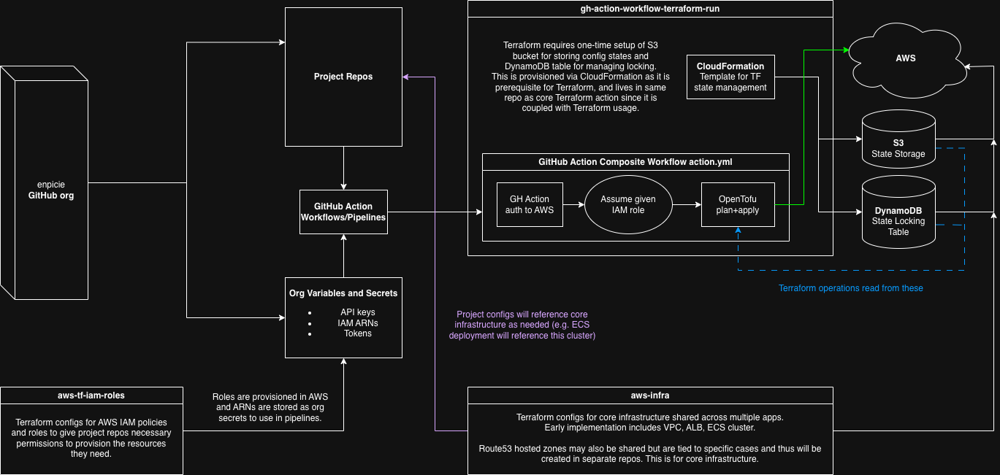

# Infrastructure-Documentation

Documentation for `enpicie` GitHub org infrastructure.

## Core Infrastructure Stack

- **CI/CD Pipelines**: GitHub Actions
- **Cloud Service Provider**: AWS
- **Provisioning Tool**: Terraform via OpenTofu

## Goals

- Automate deployments and consume reusable pipeline stages for repeated work
- Minimize manual steps to obtain proper authorization for each new project
- Minimize manual steps to update permissions or alter any infrastructure config
- Avoid committing and exposing sensitive data/credentials

## Table of Contents

- [Architecture Diagram](#architecture-diagram)
- [GitHub Actions](#github-actions)
- [OIDC Setup](#oidc-setup)
- [Migration to OpenTofu](#migration-to-opentofu)

## Architecture Diagram

- **[gh-action-workflow-terraform-run](https://github.com/enpicie/gh-action-workflow-terraform-run)** is the core reusable GH Actions workflow to conduct Terraform runs for all projects
  - Owns CloudFormation templates to provision pre-requisite backend for Terraform state management
  - Allows projects to pass in Terraform variables via `TF_VARS_*` env vars as needed
- **[aws-tf-iam-roles](https://github.com/enpicie/aws-tf-iam-roles)** manages Terraform config for IAM roles to be assumed for Terraform runs by project pipelines based on configuration needs
  - Creates roles with permissions for different sets of AWS services for various use cases
  - Role ARNs are saved as GitHub Organization secrets for projects to use in Actions pipelines
  - Any new roles/permission needs will be updated in this repo as needed
- **[aws-infra](https://github.com/enpicie/aws-infra)** manages Terraform config for core shared infrastructure
  - Primarily VPC, ALB, and ECS cluster
  - Only houses shared app-independent resources

All core repositories above use one-time manually created IAM roles for permissions required for provisioning their respective resources.

## GitHub Actions

GitHub Actions workflows can be composed in pipelines to encapsulate units of work that may be reused across different projects. As mentioned above, the core deployment workflow is [gh-action-workflow-terraform-run](https://github.com/enpicie/gh-action-workflow-terraform-run).

Repos named with pattern `gh-action-workflow-*` are Composite Workflows for GitHub Actions pipelines with steps that may be commonly used across projects. Documentation for each action can be found in its repo's README.

- [gh-action-workflow-terraform-run](https://github.com/enpicie/gh-action-workflow-terraform-run) - Run Terraform for given config
- [gh-action-workflow-build-python-lambda-layer-zip](https://github.com/enpicie/gh-action-workflow-build-python-lambda-layer-zip) - Builds .zip file for Python Lambda Layer
  - Used to ensure Lambdas have required dependencies at runtime
- [gh-action-workflow-upload-lambda-zip](https://github.com/enpicie/gh-action-workflow-upload-lambda-zip) - Uploads .zip package for a Lambda to S3
  - **Should be done via Terraform where possible**
  - _TODO: determine if adomi-san-bot can be improved to manage Lambda .zip via Terraform alone_

## OIDC Setup

All roles share a trust relationship that allows GitHub actions to authenticate to AWS and assume a role based on a given ARN. Since HCP Terraform is no longer used, AWS only needs to establish trust with the GitHub Actions agent via OIDC Provider for GitHub.

_This OIDC provider was manually created in AWS._

## Migration to [OpenTofu](https://opentofu.org/)

OpenTofu is built on Terraform and intended to continue enabling the use of Terraform in various projects as Hashicorp has and may continue to change its licensing.

In other words, it is basically a wrapper for Terraform CLI. Thus, the migration from HCP Terraform to OpenTofu via GitHub Actions was done to remove the obstructive layer of HCP Terraform and manage runs more manually but directly.
